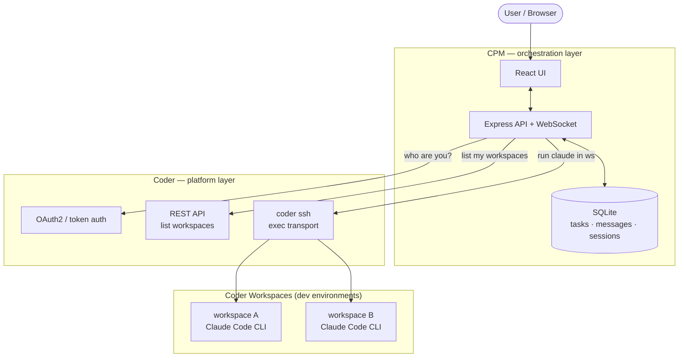
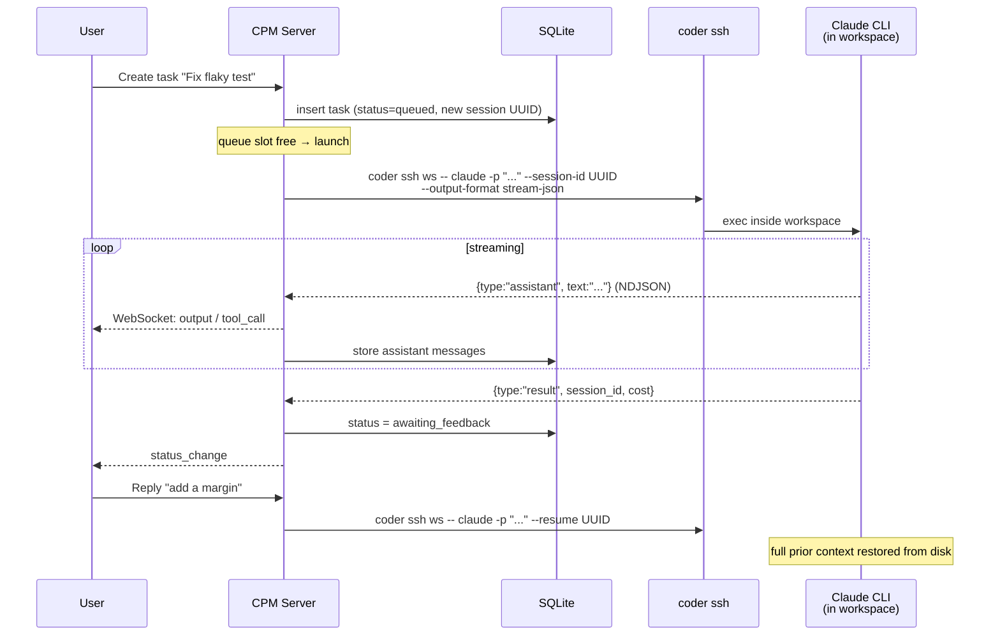
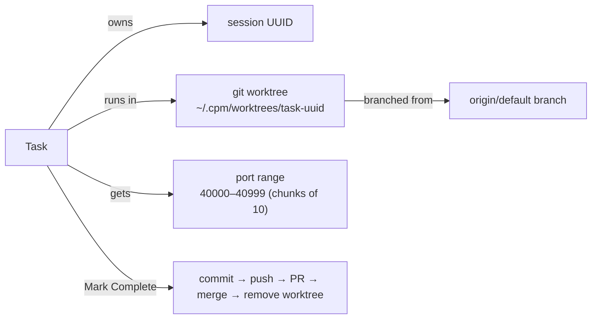
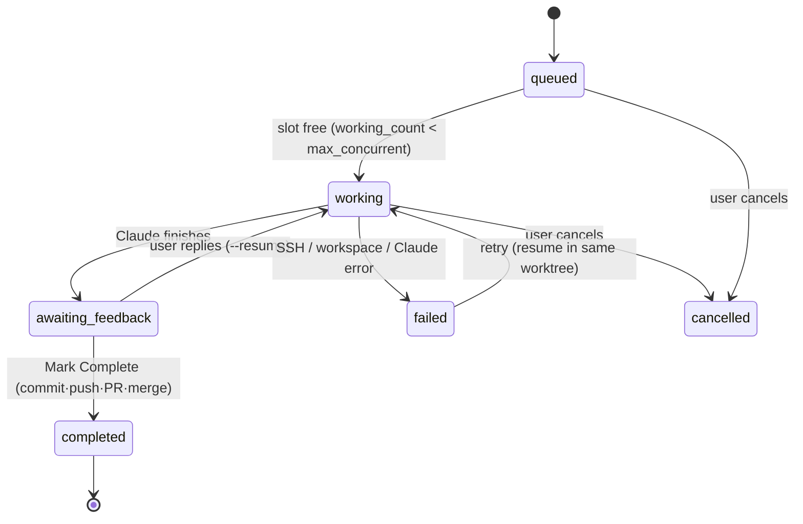
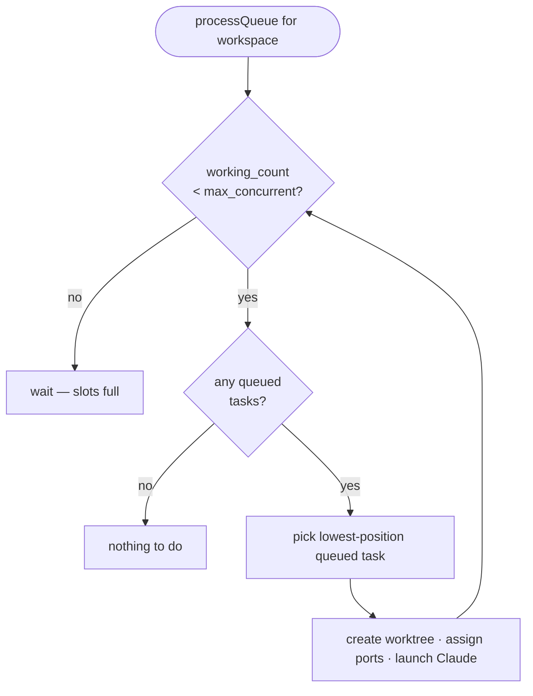
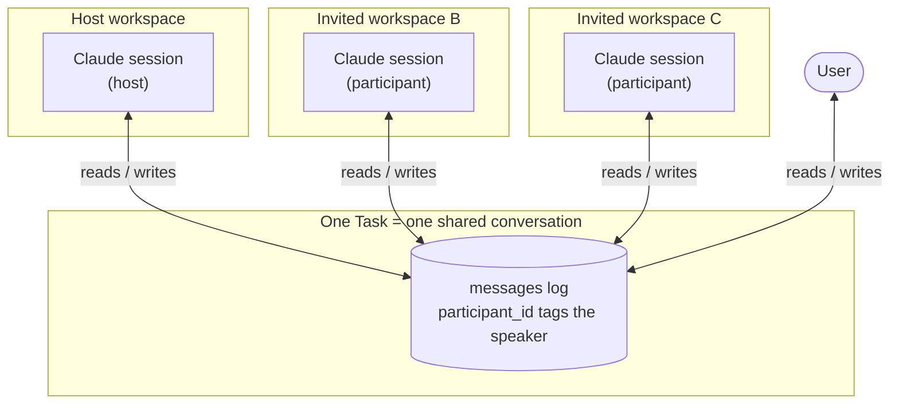
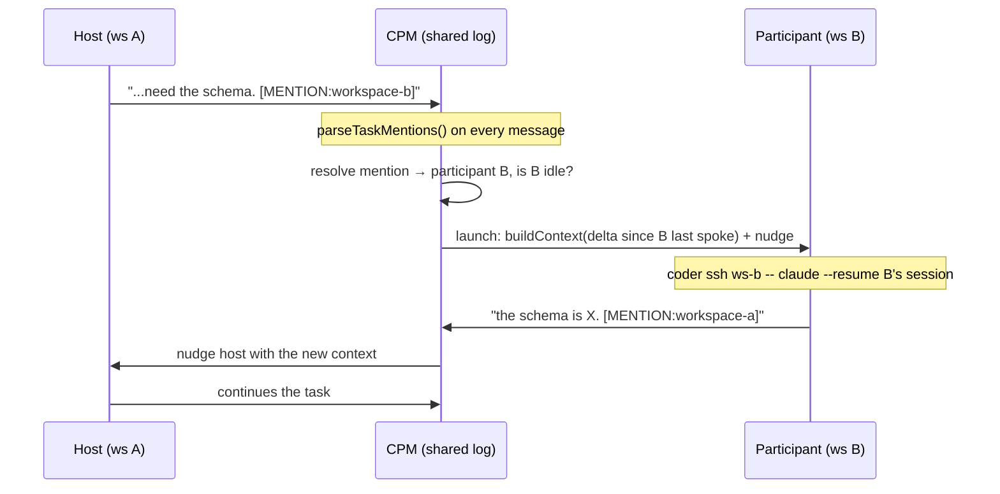
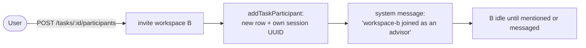
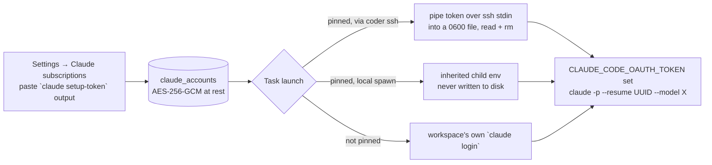
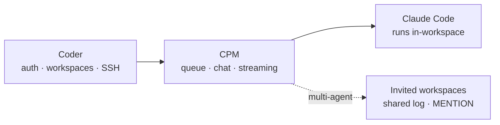

# CPM — A Visual Overview

**Coder Project Manager (CPM)** is a web app that turns Claude Code from a single
interactive terminal session into a **managed, multi-workspace task queue**. You
queue work, CPM runs Claude inside the right Coder workspace, and you review and
iterate through a chat UI — without babysitting a terminal.

This document is the picture-first tour. For the full spec see
[`SPEC.md`](./SPEC.md); for the concurrency model see [`WORKTREES.md`](./WORKTREES.md).

---

## 1. CPM in relation to Coder

Coder gives you **workspaces** (cloud dev environments) and the **auth + transport**
to reach them. CPM sits on top as an **orchestration layer** — it never replaces
Coder, it drives it. Auth, workspace ownership, and access control all stay with
Coder; CPM only borrows the user's token to act *as that user*.

| Layer | Owns | CPM's relationship |
|---|---|---|
| **Coder** | Workspaces, users, RBAC, network transport | CPM is a *client* — it authenticates as the user and calls Coder |
| **CPM** | Task queue, conversation history, streaming UI | Adds workflow that Coder doesn't provide |
| **Claude Code** | Actually doing the work inside a workspace | CPM launches and resumes it; it runs *in* the workspace, not on the CPM server |

**Key principle:** CPM defers authorization to Coder wherever Coder has an
opinion. It keeps the user's Coder token server-side in the SQLite `sessions`
table; the browser holds only an opaque, httpOnly `session_id` cookie that keys
into that row. Every Coder call is made with the stored token — so a user can
only ever touch workspaces Coder already lets them touch.

**The exception** is data CPM owns rather than mirrors from Coder. Coder has no
opinion on these, so CPM scopes them itself:

- **Tasks** are per-user — `requireTaskAccess` 404s a task belonging to someone
  else, and `listTasks` filters by `user_id`.
- **Claude subscription accounts** are per-user and never shared. A stored token
  is a bearer credential for someone's paid subscription, and staging one into a
  workspace exposes it to anyone with a shell there — so every read, write, and
  resolve is scoped by `user_id`. Without that, any authenticated user could pin
  someone else's subscription to a task in a workspace they control and read the
  token out of the process environment.

---

## 2. How CPM layers Claude on top of Coder

CPM never runs Claude on its own server. It uses Coder's SSH transport to launch
the `claude` CLI **inside the target workspace**, where Claude has native access
to the filesystem, git, tools, and its own on-disk memory. CPM's job is to
**spawn, stream, parse, and persist**.

The **session UUID** is the thread of continuity:

- **First run** → `--session-id <uuid>` (creates the session on the workspace).
- **Every reply** → `--resume <uuid>` (Claude reloads full history from
  `~/.claude/projects/` on the workspace — survives CPM restarts).

Each task runs in its own **git worktree** on its own branch (see `WORKTREES.md`),
so multiple tasks in one workspace never step on each other. "Mark Complete"
commits → pushes → opens a PR → merges → removes the worktree.

---

## 3. How task queueing works

Each workspace has its own ordered queue. CPM runs **up to `max_concurrent`
tasks per workspace at once** (default 3; set to 1 for strictly sequential).
`processQueue` fills free slots in `position` order.

The scheduler loop, run whenever a task is created or reaches a terminal state:

Rules that fall out of this:

- A task ending (**completed / failed / cancelled**) re-runs `processQueue`, which
  pulls the next queued task in — the queue auto-advances.
- Only `working` tasks count against `max_concurrent`. When a task reaches
  `awaiting_feedback` it **frees its slot**, so a queued task can launch while
  another awaits your feedback. Replying re-queues the task, which must
  re-acquire a slot before it resumes.
- `position` uses gaps (10, 20, 30…) so `queued` tasks can be reordered without
  rewriting every row.
- On CPM restart, **all** `working` tasks are reconnected (not just one).

---

## 4. Inter-workspace communication (invited agents)

A task has a **host** agent (its own workspace). You can **invite other
workspaces** into the task as *participants* ("advisors"). Every agent — host and
guests — reads and writes **one shared message log**; each keeps its **own Claude
session** on its **own workspace**. This lets an agent in workspace A consult an
agent in workspace B within a single conversation.

### Turn-passing: the `[MENTION:]` tag

There is **no round-robin or lock** on who speaks. Turn-passing is entirely
event-driven: any agent can emit `[MENTION:workspace_name]` in its response. CPM
scans every message as it's written and *nudges* the mentioned agent — but only if
that agent is **idle** and has **unseen context**.

**Context building** — when an agent is nudged, CPM hands it only what it hasn't
seen: messages since its own last turn, minus its own prior output, formatted as a
`[TASK CONTEXT] … [END CONTEXT]` block prepended to the prompt. So each agent
catches up without re-reading the whole thread.

Two things drive a participant to speak — and *only* these two:

| Trigger | Source |
|---|---|
| `[MENTION:workspace_name]` in any message | Automatic — emitted by any agent |
| Explicit nudge / direct message | Human, via the task UI / API |

There is **no** end-of-conversation broadcast: if the host's final turn contains no
`[MENTION:]`, participants stay quiet until mentioned or nudged. A concurrency
guard skips a launch if that participant is already running, so nudges can't
double-fire.

### How a workspace joins

Each participant is tracked in `task_participants` with its own
`claude_session_id` and detected `project_dir`; guests run as
`coder ssh <their-workspace>` child processes, so they operate in *their* codebase
while collaborating in the *host* task's conversation.

---

## 5. Choosing the model and the Claude subscription

By default the Claude subscription a task burns belongs to the **workspace** —
whatever `claude login` was run inside it. CPM can override that per task, so one
user with two subscriptions can decide which one pays for which work.

Both the **model** and the **subscription** are switchable mid-task. Each turn is
a fresh `claude -p --resume <uuid>` invocation, and a session transcript records
the model per assistant message rather than pinning one for its lifetime — so
successive turns of one conversation can differ. A change applies from the next
turn; the turn already running finishes on what it started with.

Mechanics worth knowing:

- Tokens come from `claude setup-token` (an `sk-ant-oat…` value). CPM cannot run
  the browser OAuth flow itself, so the user pastes it.
- Delivery depends on how the turn is started. Runs reached over **`coder ssh`**
  get the token piped over the staging process's **stdin** into a 0600 file, which
  the launch command reads into the environment and deletes immediately — SSH won't
  forward environment variables, so a file is the only option. Runs spawned
  **locally** (the CPM host, including advisors there) inherit it from the child's
  environment and nothing is written to disk. Neither path puts the token in an
  argv, so it can't appear in `ps` on either host or in CPM's logs.
- **What that does not buy you.** Once exported, the value is readable via
  `/proc/<pid>/environ` by anything running as that uid, for the whole session —
  *longer* than the staged file exists. So the local path avoids leaving a
  credential on disk but is not otherwise safer. The actual control is that
  accounts are per-user and a token only ever goes to a workspace its owner may
  use; on a genuinely shared host, a pinned subscription is visible to anyone with
  a shell there either way.
- The launch prefix `unset`s `ANTHROPIC_API_KEY`, `ANTHROPIC_AUTH_TOKEN`,
  `ANTHROPIC_BASE_URL` and the Bedrock/Vertex switches first. Those take
  precedence over `CLAUDE_CODE_OAUTH_TOKEN`, so a template that exports one would
  otherwise silently bill a different account.
- **Fail closed:** if a pinned subscription can't be prepared (deleted, wrong
  owner, undecryptable, workspace unreachable, or unsafe to stage), the turn fails
  with an explanatory message instead of falling back to the workspace's login.
  Launch-failure paths remove anything they staged, so a token can't be left behind
  by a spawn error or an aborted launch.
- Rate limits are tracked per *subscription*, not per workspace — see
  `rate_limits.subscription_key` (`acct:<id>` or `ws:<name>`).

### Operational dependency: the encryption key

Subscription tokens are encrypted at rest. The key is resolved in this order:

1. `CPM_SECRET_KEY` — 64 hex characters (32 bytes). **Preferred for deployment**:
   the key never lands on disk beside the database.
2. Otherwise `secret.key`, generated once at 0600 in the *same directory as the
   database* (derived from `DATABASE_PATH`, so a compiled run under `dist/` and a
   dev run agree).

Consequences to plan for:

- **Restoring `cpm.db` without the matching key** leaves every stored token
  undecryptable. Nothing else breaks and no task silently misruns — affected tasks
  fail with a message telling the user to re-paste — but the tokens must be
  re-added from `claude setup-token`. Back up the key alongside the database, or
  set `CPM_SECRET_KEY` so there is nothing extra to back up.
- A malformed `secret.key` is a hard error rather than being regenerated, so a
  truncated write or half-restored backup can't quietly destroy the tokens.
- The generated-key path protects against casual `.db` copies, **not** against
  someone who can read the whole data directory — key and ciphertext live side by
  side there. Use `CPM_SECRET_KEY` if that matters.

---

## Summary

- **Coder** provides identity, workspaces, and the pipe to reach them.
- **CPM** adds the queue, the conversation, and the real-time UI — delegating auth
  to Coder, and scoping the data Coder has no opinion on (tasks, subscriptions) by
  user itself.
- **Claude** runs *inside* each workspace, one resumable session per task (and per
  invited participant).
- **Invited agents** collaborate through one shared log, passing turns with
  `[MENTION:]` — no central lock.
